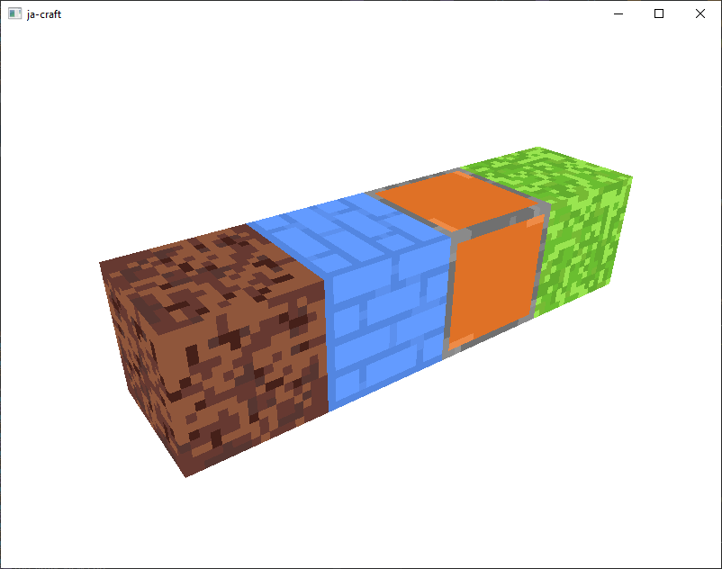
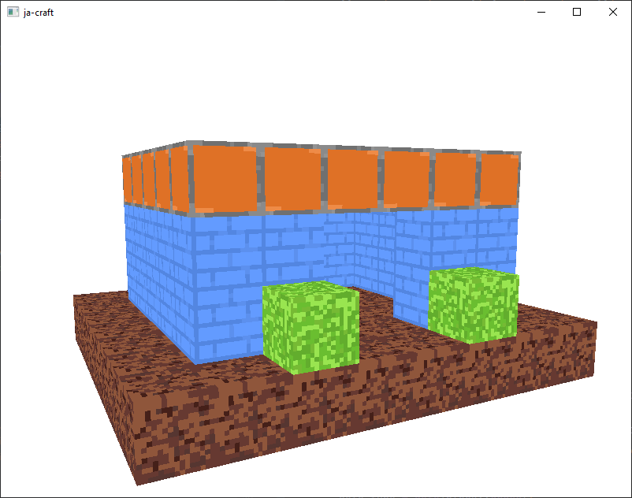

# ja-craft
### Description
A simple minecraft-like voxel renderer written in C++20 using OpenGL. The project is far from finished, the source code is a bit messy, and physics work (sometimes). 
😥

### Screenshots

